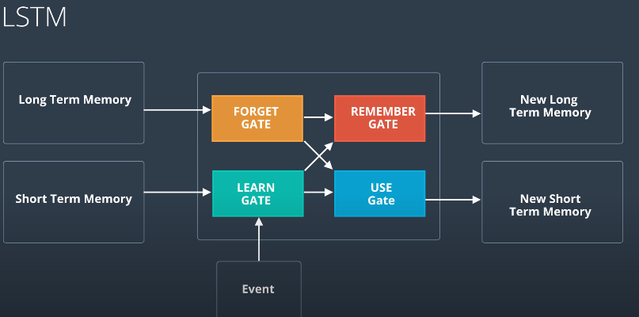
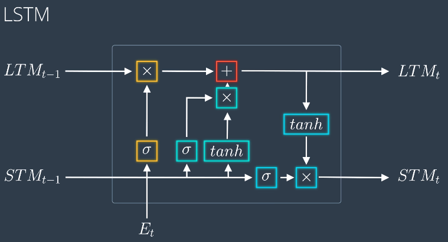
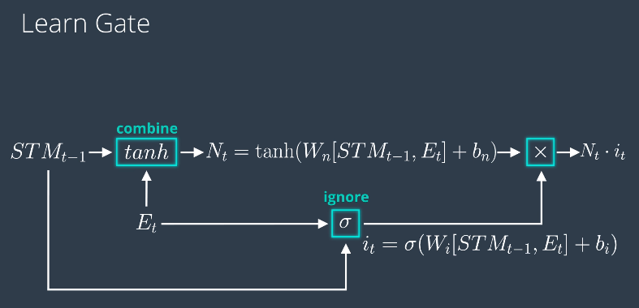
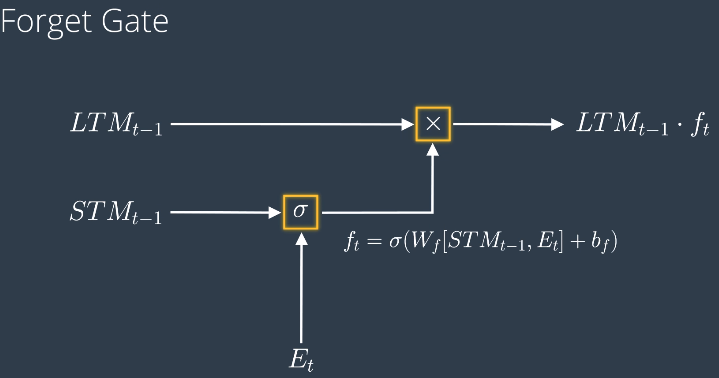
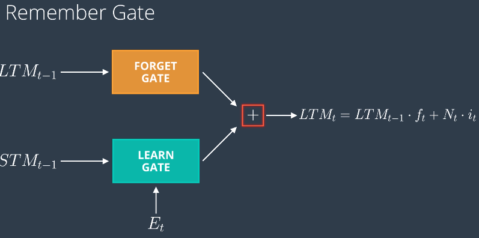
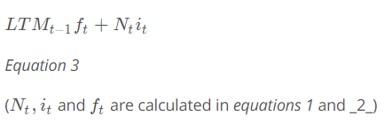
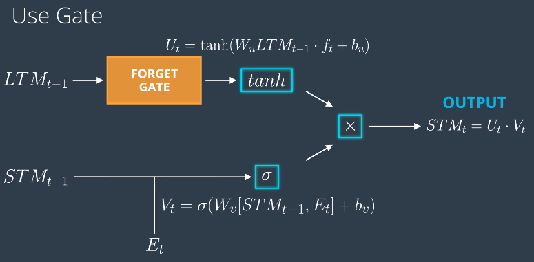

## pytorch.nn.RNN vs pytorch.nn.LSTM
pytorch tips: 
* batch_first - if true, dim of input/output will be (batch_size, seq_len, ...). If false (by default), the the input/output dim will be (seq_len, batch_size, ...)); note hidden will always have dim (num_layers * num_directions, batch_size, hidden_size)
* num_directions - If the RNN is bidirectional, num_directions should be 2, else it should be 1
#### In nn.RNN
* The inputs are 
    1. input ('event'/new datapoint), dim (batch_size, seq_len, input_size), input_size is the # features for each time point
    1. hidden ('old memory', customized # layers AND # dimensions), dim (num_layers * num_directions, batch_size, hidden_size)
* The outputs are
    1. output (prediction) - In pytorch, default tourch.nn.RNN, the output has dimension of (batch_size, seq_len,  num_directions * hidden_size), but this can be customized to the desired output dimension by adding more layers after the default RNN layer. See customized RNN with torch.nn.RNN + Linear layer <pre>..\deep_learning_v2_pytorch\recurrent-neural-networks\time-series\Simple_RNN.ipynb</pre>
    1. hidden ('new memory'), dim (num_layers * num_directions, batch_size, hidden_size)

#### In nn.LSTM
* The inputs are 
    1. input ('event'/new datapoint)
    1. Long Term Memory ('old LTM', customized # layers and # dimensions)
    1. Short Term Memory ('old STM', previous prediction)
* The outputs are
    1. output (new prediction, also serves as new STM)
    1. Long Term Memory
    

## LSTM 
* Overall Structure  

1. Learn Gate  
  
Equation 1  
  
1. Forget Gate  
  
Equation 2  

1. Remember Gate  
  
Equation 3  

1. Use Gate  

Equation 4  
  
The output of use gate is the output of prediction as well as the new short-term memory STMt

## Getting the best model

To set your hyperparameters to get the best performance, you'll want to watch the training and validation losses. If your training loss is much lower than the validation loss, you're overfitting. Increase regularization (more dropout) or use a smaller network. If the training and validation losses are close, you're underfitting so you can increase the size of the network.

## Hyperparameters

Here are the hyperparameters for the network.

In defining the model:
* `n_hidden` - The number of units in the hidden layers.
* `n_layers` - Number of hidden LSTM layers to use.

We assume that dropout probability and learning rate will be kept at the default, in this example.

And in training:
* `batch_size` - Number of sequences running through the network in one pass.
* `seq_length` - Number of characters in the sequence the network is trained on. Larger is better typically, the network will learn more long range dependencies. But it takes longer to train. 100 is typically a good number here.
* `lr` - Learning rate for training

Here's some good advice from Andrej Karpathy on training the network. I'm going to copy it in here for your benefit, but also link to [where it originally came from](https://github.com/karpathy/char-rnn#tips-and-tricks).

> ## Tips and Tricks

>### Monitoring Validation Loss vs. Training Loss
>If you're somewhat new to Machine Learning or Neural Networks it can take a bit of expertise to get good models. The most important quantity to keep track of is the difference between your training loss (printed during training) and the validation loss (printed once in a while when the RNN is run on the validation data (by default every 1000 iterations)). In particular:

> - If your training loss is much lower than validation loss then this means the network might be **overfitting**. Solutions to this are to decrease your network size, or to increase dropout. For example you could try dropout of 0.5 and so on.
> - If your training/validation loss are about equal then your model is **underfitting**. Increase the size of your model (either number of layers or the raw number of neurons per layer)

> ### Approximate number of parameters

> The two most important parameters that control the model are `n_hidden` and `n_layers`. I would advise that you always use `n_layers` of either 2/3. The `n_hidden` can be adjusted based on how much data you have. The two important quantities to keep track of here are:

> - The number of parameters in your model. This is printed when you start training.
> - The size of your dataset. 1MB file is approximately 1 million characters.

>These two should be about the same order of magnitude. It's a little tricky to tell. Here are some examples:

> - I have a 100MB dataset and I'm using the default parameter settings (which currently print 150K parameters). My data size is significantly larger (100 mil >> 0.15 mil), so I expect to heavily underfit. I am thinking I can comfortably afford to make `n_hidden` larger.
> - I have a 10MB dataset and running a 10 million parameter model. I'm slightly nervous and I'm carefully monitoring my validation loss. If it's larger than my training loss then I may want to try to increase dropout a bit and see if that helps the validation loss.

> ### Best models strategy

>The winning strategy to obtaining very good models (if you have the compute time) is to always err on making the network larger (as large as you're willing to wait for it to compute) and then try different dropout values (between 0,1). Whatever model has the best validation performance (the loss, written in the checkpoint filename, low is good) is the one you should use in the end.

>It is very common in deep learning to run many different models with many different hyperparameter settings, and in the end take whatever checkpoint gave the best validation performance.

>By the way, the size of your training and validation splits are also parameters. Make sure you have a decent amount of data in your validation set or otherwise the validation performance will be noisy and not very informative.