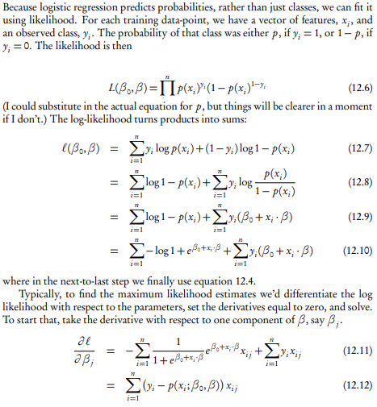
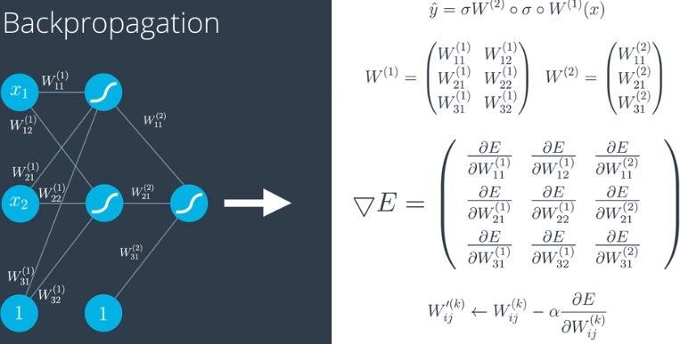
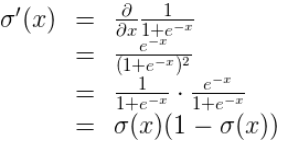
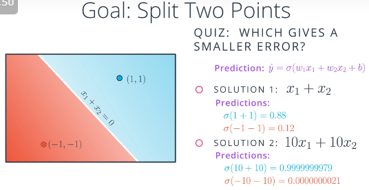

# Logistic Regression

### Sigmoid function
Mapping real numbers to range [0,1] as "probabilities".

### Loss function
The log loss (a.k.a. cross entropy) function (equation 12.7 below) is actually just the log likelihood function from the MLE approach [[reference](https://www.stat.cmu.edu/~cshalizi/uADA/12/lectures/ch12.pdf)]  

### Fitting the model
* MLE - solve the optimal beta that minimize the log loss function (equivalently, maximize the log likelihood function)
* Gradient Descent - discussed below

# Neural Networks

## Perceptron and (Stochastic) Gradient Descent
The gradient_descent.ipynb notebook uses for loop to go through all data points in each epoch, updating the weight in iteration of each data point. This works because the overall Error function is sum (mean) of the error of every data points. The derivatives are also independent amongst the data points. Therefore, the overall gradient is the sum of individual data point gradient!

This however can be viewed as applying the stochastic gradient descent approach. i.e. With # epochs = 100, and each batch contains only 1 data point

### Difference from Gradient Descent vs perceptron notebooks
They are largely the same because both updates the coefficients with log loss function. Except
* The Gradient Descent notebook uses sigmoid to produce a prediction of real number within [0, 1], whereas perceptron notebook produces a binary prediction of {0, 1}
* Gradient Descent looks at all data points to maximize the likelihood; Perceptron only looks at the data points that were mis-classified

## Continuous Perceptrons to NN
Using the sigmoid function as the activation function, we can always convert the binary perceptron to a continuous perceptron. Then combining perceptrons will lead to a non-linear neural network 

### More nodes in output layer
This means multi-class classification that reused the info from the input and hidden layers.  

### More Layers 
Simple non-linear models to more complex non-linear models  
Note: It's the (activation function) && (hidden layers >= 1) that introduce the non-linearity  

## Feedforward and Backpropagation
Using the chain rule, we are able to resovle the derivatives of all parameters (weights) in the network  

* derivatives of the sigmoid function  

## Training NN
### Early Stopping
Plot error vs Epochs, and stop when minimizing diff of testing error - training error

### Regularization
Problem with large weights:
* Same split but more extreme probabilities -> overfitting
* Making gradient closer to 0 in larger range, hence difficult to descend -> too certern

* L1 regularization - sparse, feature selection 
* L2 regularization - less sparse, for training

### Dropout
When going through epochs, randomly turn off nodes for training, by assigning a probability each node will be dropped (e.g. = 0.2), that force training the models on the 'weak' nodes

### Random Restart
Start from a few random restart points to avoid being trapped in local minimum in gradient descent

### Other activation functions
* Sigmoid: gradient gets small (flat) on both sides -> very slow descending
* Hyperbolic Tangent (tanh): similar to sigmoid, but larger derivatives, -> better descending
* ReLU: derivative = 1 when f(x) > 0; Note the output layer is better to change back to sigmoid / tanh, for classification problem, otherwise the final output will be linear on one side

### Learning Rate Decay and Momentum
* Learning Rate Decay: reduce learning rate as epoch # increases
* Momentum: step(n) = step(n) + beta\*step(n-1) + beta^2\*step(n-2) + ...; This is to keep the descending step momentum trying to overpass the local minimum trap

### To understand the dimensions
#### Classification Problem
1. Epoch - E, each epoch contains B (mini) batches
1. Batch - B, each batch contains N data points
1. Data Points - N, data set of (X1, X2, ..., Xn, ... XN)
1. Features - K, each data point Xn has K features (x1, x2, ... xk, ... , xK)
1. Classes - classification problem with C classes.

For each data point n,
1. input Xn = (x1, x2, ... xk, ... , xK)
1. target c which is a scalar with value in the range [1, C] (sometimes using index range [0, 1-C])
1. linear layer output before final activation is a vector of C: Yn = (y1, y2, ... yc, ..., yC)
1. log softmax activation is a vector of C: (log ey1/sumC(eY), log ey2/sumC(eY), ... log eyc/sumC(eY), log eyC/sumC(eY))
1. negative log-likelihood loss is a scalar: ln=-log eyc/sumC(eY)

In each batch
1. input shape (N, K)
1. target (label) shape (N, 1), each element has a value in the range [1, C]
1. hidden layer shape is customized hyper param
1. log softmax activated output shape (N, C)
1. NLLLoss is a scalar L = sumN(ln)
